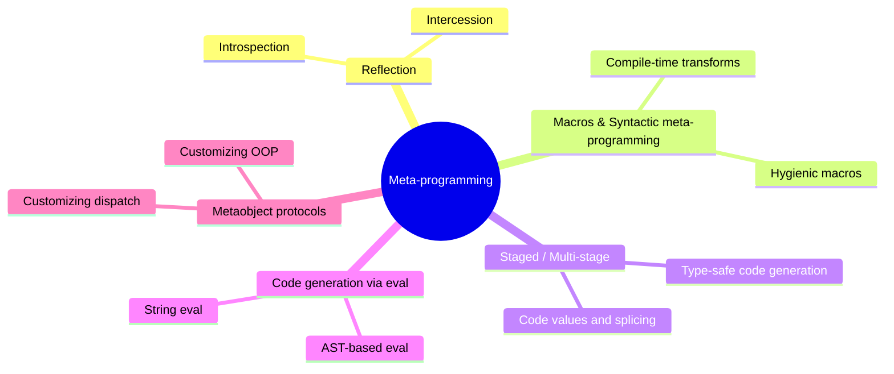

Below is a long, structured study report you can use directly or adapt. I’ll stick to Ruby and Lisp as requested, and I’ll include many runnable-style code examples plus references you can follow up.

---

# Exploring Meta-Programming
**Type: Study Report**

---

## Abstract

Meta-programming—writing programs that write, analyze, or transform other programs—is a central idea in language design, especially in highly dynamic languages. This report surveys meta-programming by:

- Analyzing the meta-programming features of **Ruby** and **Lisp (Common Lisp)** with extensive code examples.
- Discussing **reflection and metaobject protocols (MOPs)** as the mechanisms that enable meta-programming.
- Examining **language design implications** for syntax, semantics, and features that facilitate or hinder meta-programming.
- Analyzing the **interaction between meta-programming and type systems**, including type safety and type inference when code is generated dynamically.

We rely on key sources such as the Common Lisp HyperSpec and classic Lisp literature【turn7search0】【turn7search7】, Ruby’s official documentation and well‑known Ruby meta-programming texts【turn6search0】【turn6search7】【turn0search0】【turn3search1】, and foundational work on reflection and MOPs【turn4search1】【turn4search5】【turn4search10】【turn4search14】. Modern typed meta-programming systems (e.g., MetaOCaml) illustrate how some of the type‑safety challenges can be addressed【turn2search0】【turn2search4】.

---

## Table of Contents

- 1 Introduction
- 2 Meta-Programming: Definitions and Concepts
- 3 Ruby Meta-Programming in Depth
- 4 Lisp (Common Lisp) Meta-Programming in Depth
- 5 Reflective Capabilities and Metaobject Protocols
- 6 Meta-Programming and Language Design
- 7 Meta-Programming and Type Systems
- 8 Comparative Summary: Ruby vs Lisp
- 9 Practical Guidelines and Open Challenges
- 10 References

---

## 1 Introduction

Meta-programming underpins many advanced techniques: domain‑specific languages (DSLs), object‑relational mappers, mocking frameworks, and even language implementations themselves. Two language families are especially associated with “deep” meta-programming:

- **Ruby**, with its pervasive open classes, `eval`, `method_missing`, and blocks, often praised for enabling expressive DSLs and frameworks【turn0search0】【turn3search4】.
- **Lisp**, with its **homoiconic syntax** (programs are data represented as S‑expressions) and powerful macro system, historically central to the idea that programs can manipulate their own structure【turn7search10】【turn1search5】.

This report studies both in detail and asks: what properties of a language make meta-programming natural? And how do these properties interact with **syntax**, **semantics**, and **type systems**?

---

## 2 Meta-Programming: Definitions and Concepts

### 2.1 What is meta-programming?

A common working definition:

> Meta-programming is the writing of programs that write, manipulate, or reason about other programs (including themselves).

Concrete forms include:

- **Code generation**: emitting new code (as strings or ASTs) to be executed later.
- **Reflection**: programs inspecting their own structure (introspection) and changing their own behavior at runtime (intercession)【turn4search5】【turn4search9】.
- **Macros**: syntactic transformations that happen before evaluation, especially compile-time transformations in Lisp【turn7search10】.
- **Staged/multi-stage programming**: programs with explicit stages that build and later run generated code with static guarantees about well-formedness and types【turn2search0】【turn2search4】.

### 2.2 Reflection: introspection and intercession

Pattie Maes and others formalized reflection as a program’s ability to represent and modify its own execution state and structure【turn4search5】【turn4search9】:

- **Introspection**: the program can observe aspects of its own state (e.g., query the class of an object, list methods, read fields).
- **Intercession**: the program can alter its own execution (e.g., add a method, change dispatch behavior, modify a class hierarchy).

Ruby and Lisp both expose introspection and intercession, though Lisp’s MOPs go deeper by making the object model itself first-class and customizable【turn0search7】【turn4search10】.

### 2.3 Metaobject protocols (MOPs)

A **metaobject protocol** exposes the implementation of a language or system as a protocol of objects (metaobjects) that users can specialize. Kiczales et al.’s *The Art of the Metaobject Protocol* demonstrates this for CLOS (Common Lisp Object System)【turn4search10】【turn4search14】:

- Classes, generic functions, methods, slot definitions, and method dispatch become objects whose behavior can be customized via standard OOP.
- This allows changing inheritance, method combination, instance allocation, and more, often without modifying the base system.

Ruby does not have a standardized MOP comparable to CLOS, but it exposes reflective APIs (e.g., `Class`, `Module`, `Method` objects, `define_method`) that approximate similar capabilities in practice【turn0search2】.

### 2.4 Kinds of meta-programming



---

## 3 Ruby Meta-Programming in Depth

Ruby is a dynamically typed, object‑oriented language with pervasive reflective capabilities. Its design makes classes and modules first-class objects that can be inspected and modified at runtime【turn0search0】【turn6search8】.

### 3.1 Core Ruby features that enable meta-programming

Key mechanisms:

- **Open classes and monkey patching**: you can reopen any existing class and add/replace methods at runtime.
- **`eval`/`class_eval`/`instance_eval`**: evaluate code (from strings or blocks) in a given context【turn6search0】【turn6search7】【turn6search10】.
- **`define_method`**: define methods dynamically from symbols or blocks.
- **`method_missing` and `respond_to_missing?`**: intercept calls to undefined methods and implement dynamic behavior【turn8search0】【turn8search11】.
- **Blocks, Procs, and lambdas**: higher-order values that can be stored, passed, and later invoked.

### 3.2 Open classes and monkey patching

Ruby classes are always “open”: you can add methods at any time.

```ruby
# Reopening String
class String
  def shout
    upcase + "!!!"
  end
end

puts "hello".shout   # => "HELLO!!!"
```

This is extremely powerful but can lead to **name clashes** and hard-to-track behavior. Real-world cases include Ruby 1.8.7 backporting `Symbol#to_proc` differently than Rails’ earlier monkey patch, which broke Rails【turn3search14】; and Rails core maintainers later argued that monkey patching makes upgrading painful and insecure【turn3search12】【turn3search16】.

Guidelines:

- Prefer **refinements** or decorators when you only need localized changes.
- Avoid patching core classes (`String`, `Array`, `Hash`) in libraries.

### 3.3 `eval`, `class_eval`, and `instance_eval`

Ruby provides several `eval`-style APIs:

- `Kernel#eval` evaluates a string in the current binding【turn6search0】.
- `Module#class_eval` (alias `module_eval`) evaluates code in the context of a module/class, which lets you define methods on it【turn6search7】.
- `BasicObject#instance_eval` evaluates code with `self` set to a specific receiver, giving access to its instance variables and private methods【turn6search10】【turn6search15】.

Example: using `class_eval` to add methods dynamically.

```ruby
class Greeting
end

name = "world"
code = "def hello; \"Hello, #{name}!\"; end"

Greeting.class_eval(code)
puts Greeting.new.hello   # => "Hello, world!"
```

Example: `instance_eval` to peek into an object’s private state.

```ruby
class Person
  def initialize(name)
    @name = name
  end

  private
  def secret
    "sssh"
  end
end

p = Person.new("Alice")

puts p.instance_eval { @name }   # => "Alice"
puts p.instance_eval { secret }  # => "sssh"
```

### 3.4 `define_method` and dynamic method definition

`define_method` defines a method by name from a block or a method object, allowing late binding and closures:

```ruby
class Greeter
  def initialize(greeting_word)
    @word = greeting_word
  end

  # Define a method 'greet' that uses the instance variable
  define_method(:greet) do |name|
    "#{@word}, #{name}!"
  end
end

friendly = Greeter.new("Hi")
formal   = Greeter.new("Good day")

puts friendly.greet("Alice")   # => "Hi, Alice!"
puts formal.greet("Bob")      # => "Good day, Bob!"
```

You can also iterate to generate many methods:

```ruby
class Attributes
  [:name, :email, :age].each do |attr|
    define_method(attr) do
      instance_variable_get("@#{attr}")
    end

    define_method("#{attr}=") do |value|
      instance_variable_set("@#{attr}", value)
    end
  end
end

a = Attributes.new
a.name = "Alice"
a.email = "alice@example.com"
puts a.name    # => "Alice"
puts a.email   # => "alice@example.com"
```

### 3.5 `method_missing` and dynamic dispatch

When Ruby cannot find a method, it calls `BasicObject#method_missing`【turn8search0】【turn8search12】. This is widely used for dynamic interfaces and DSLs.

Example: a struct-like access:

```ruby
class FlexibleStruct
  def initialize
    @data = {}
  end

  def method_missing(name, *args)
    if name.to_s.end_with?("=")
      key = name.to_s[0..-2]
      @data[key.to_sym] = args.first
    else
      @data[name.to_sym]
    end
  end

  def respond_to_missing?(name, include_private = false)
    true # simplistic; in real code, check keys
  end
end

s = FlexibleStruct.new
s.name = "Bob"
s.age  = 30

puts s.name   # => "Bob"
puts s.age    # => 30
```

Best practices for `method_missing`【turn8search11】【turn8search10】【turn8search15】:

- Always implement `respond_to_missing?` alongside it.
- Keep implementations simple and predictable.
- Prefer `define_method` for patterns that can be resolved eagerly.
- Avoid deep chains of `method_missing` calls (performance and debuggability suffer).

### 3.6 Reflection API for introspection

Ruby’s object model is highly reflective. You can query classes, modules, method lists, ancestors, instance variables, and more【turn6search8】【turn3search7】:

```ruby
class Base
  def foo; end
end

class Derived < Base
  def bar; end
end

puts Derived.ancestors.inspect
# => [Derived, Base, Object, Kernel, BasicObject]

puts Derived.instance_methods(false).grep(/bar/)
# => [:bar]

d = Derived.new
d.instance_variable_set("@x", 10)
puts d.instance_variables  # => [:@x]
```

### 3.7 Case study: a tiny DSL for validators

A typical Ruby meta-programming pattern is to build DSLs with method definitions and blocks:

```ruby
class Validator
  attr_reader :errors

  def initialize
    @rules = []
    @errors = []
  end

  def self.validate(&block)
    v = new
    v.instance_eval(&block)
    v
  end

  def presence(field)
    @rules << proc { |obj|
      if obj.send(field).nil? || obj.send(field).to_s.strip.empty?
        @errors << "#{field} must be present"
      end
    }
  end

  def check(obj)
    @errors = []
    @rules.each { |r| r.call(obj) }
    @errors
  end
end

# Usage
validator = Validator.validate do
  presence :name
  presence :email
end

class User
  attr_accessor :name, :email
  def initialize(name, email)
    @name = name; @email = email
  end
end

u = User.new("", nil)
puts validator.check(u).inspect
# => ["name must be present", "email must be present"]
```

This DSL uses `instance_eval` to evaluate the block in the context of the `Validator` instance, and blocks to record validation rules.

---

## 4 Lisp (Common Lisp) Meta-Programming in Depth

Lisp’s motto “code is data” is literal: programs are written as S‑expressions (lists and atoms), which are also the core data structures of the language. This **homoiconicity** underpins its macro system and makes reflection natural【turn1search5】【turn7search17】.

### 4.1 S-expressions, homoiconicity, and `eval`

Common Lisp programs are represented as S-expressions; the reader parses text into lists and symbols:

```lisp
;; A function definition (code)
(defun add (x y) (+ x y))

;; The same code as data (a list)
'(defun add (x y) (+ x y))
;; => (DEFUN ADD (X Y) (+ X Y))
```

`eval` explicitly evaluates such data:

```lisp
(eval '(+ 1 2)) ;; => 3

;; eval can use lexical environments via eval-when and other constructs
```

The ANSI standard describes evaluation and the role of `eval`, `compile`, `compile-file`, and `load`【turn7search7】.

### 4.2 Macros: compile-time code transformation

Common Lisp macros are more powerful than text preprocessors: they operate on **parsed code** (S-expressions) and return new code to be compiled/evaluated【turn7search10】【turn7search12】.

The standard macro definition form is `defmacro`【turn7search0】:

```lisp
(defmacro my-when (condition &body body)
  `(if ,condition
       (progn ,@body)
       nil))

;; Use it
(my-when (> x 10)
  (print "big")
  (print x))
```

Expansion yields:

```lisp
(if (> x 10)
    (progn (print "big") (print x))
    nil)
```

Anaphoric macros (from Paul Graham’s *On Lisp*) deliberately introduce bindings available inside the macro body【turn1search10】【turn1search14】:

```lisp
(defmacro aif (test then &optional else)
  `(let ((it ,test))
     (if it ,then ,else)))

;; Usage
(aif (find 10 '(1 2 10 20))
     (format t "Found: ~a~%" it)
     (format t "Not found~%"))
;; Here, 'it' is bound to the result of the test
```

### 4.3 Quasiquotation and hygiene

Lisp macros rely on **quasiquotation** (backquote) to build code templates:

- `,expr` substitutes `expr` into the template.
- `,@expr` splices a list into the template.

Hygiene is largely manual: macro writers must ensure they do not accidentally capture user variables. Common approaches:

- Use **gensyms** for local bindings.
- Use carefully named packages.

Example of a macro that introduces a local binding:

```lisp
(defmacro swap (a b)
  (let ((tmp (gensym "TMP")))
    `(let ((,tmp ,a))
       (setq ,a ,b)
       (setq ,b ,tmp))))

(let ((x 10) (y 20))
  (swap x y)
  (format t "x=~a, y=~a~%" x y))
;; => x=20, y=10
```

### 4.4 Macro examples

#### 4.4.1 Logging with time measurement

```lisp
(defmacro with-timing ((time-var) &body body)
  `(let ((start (get-internal-real-time)))
     (prog1
         (progn ,@body)
       (setq ,time-var (/ (- (get-internal-real-time) start)
                          internal-time-units-per-second)))))

;; Usage
(with-timing (elapsed)
  (sleep 1)
  (format t "Elapsed: ~f seconds~%" elapsed))
```

#### 4.4.2 Domain-specific control structures

Lisp macros make it natural to embed custom control abstractions:

```lisp
(defmacro while (condition &body body)
  (let ((loop-label (gensym "WHILE-LOOP")))
    `(tagbody
        ,loop-label
        (unless ,condition (go ,(gensym "WHILE-END")))
        ,@body
        (go ,loop-label)
        ,(gensym "WHILE-END"))))

;; Note: Common Lisp has 'loop', this is just illustrative
```

### 4.5 CLOS and metaobject protocols

Common Lisp’s object system, CLOS, is built on a **metaobject protocol** (MOP). Classes, generic functions, methods, and slot definitions are represented by objects, and their behavior can be customized【turn4search10】【turn0search7】.

Key capabilities:

- Introspection: querying superclasses, slots, methods, method combinations.
- Intercession: customizing class allocation, instance initialization, method dispatch, and slot access.

Example: customizing class initialization (simplified):

```lisp
(defclass tracked-class (standard-class) ()
  (:metaclass standard-class))

;; Normally you'd define a metaclass to customize behavior
(defclass person ()
  ((name :initarg :name :accessor name))
  (:metaclass tracked-class))

;; Using MOP functions (not exported by default in all implementations):
;; (ensure-class-using-class ...) etc.
```

Full MOP usage often requires implementation-specific packages and functions, but the idea is that the language’s OO core is open to adjustment【turn0search7】.

### 4.6 Metacircular evaluator and self-description

SICP’s metacircular evaluator is a classic example: an evaluator for a Lisp dialect written in the same dialect【turn1search5】【turn1search6】. This illustrates how reflection and self-representation are inherent in Lisp.

Conceptually:

```lisp
;; Simplified sketch
(defun my-eval (exp env)
  (cond
    ((numberp exp) exp)
    ((symbolp exp) (lookup-variable exp env))
    ((eq (car exp) 'quote) (cadr exp))
    ((eq (car exp) 'if) (if (my-eval (cadr exp) env)
                            (my-eval (caddr exp) env)
                            (my-eval (cadddr exp) env)))
    ;; ... more cases
    (t (apply-proc (my-eval (car exp) env)
                   (mapcar (lambda (e) (my-eval e env)) (cdr exp))))))
```

---

## 5 Reflective Capabilities and Metaobject Protocols

### 5.1 Reflection in Ruby and Lisp

Both Ruby and Lisp provide:

- Introspection: querying classes, methods, arguments, instance variables, generic functions, etc.
- Intercession: dynamically adding methods, changing method implementations, and more.

Ruby examples:

```ruby
puts String.instance_methods(false).sort
# lists instance methods specific to String

m = String.instance_method(:upcase)
puts m arity  # => 0
```

Common Lisp examples:

```lisp
;; Class and slot introspection
(defclass foo ()
  ((x :initarg :x :accessor foo-x)))

(find-class 'foo)
;; => #<STANDARD-CLASS FOO>

;; Slot introspection depends on MOP functions (implementation-specific)
```

### 5.2 Metaobject protocols: Lisp vs Ruby

In Lisp (CLOS):

- The MOP explicitly represents classes, generic functions, methods, and slot definitions as objects.
- Specialized generic functions (e.g., `compute-effective-method`, `make-instance`) can be overridden to customize behavior.
- Kiczales et al. show how this allows language extension without modifying the core system【turn4search10】【turn4search14】.

In Ruby:

- There is no official, standardized MOP; instead, Ruby exposes classes like `Class`, `Module`, `Method`, `UnboundMethod`, and methods like `define_method`, `method_added`, `inherited`【turn6search8】.
- Many MOP-like effects can be achieved, but they are less uniform and sometimes implementation-specific.

### 5.3 Relationship between reflection and semantics

Brian C. Smith’s seminal work on reflection in Lisp emphasizes that reflective facilities can change the semantics of a language: a reflective program can rewrite its own evaluation rules【turn4search1】【turn4search3】.

Tanter and others later categorized reflective systems and discussed **open implementations**, where a module exposes its internals via a protocol so clients can adapt its behavior【turn4search15】【turn4search16】. Metaobject protocols are a special case of this idea.

---

## 6 Meta-Programming and Language Design

### 6.1 Syntax and meta-programming

A language’s syntax profoundly affects how natural meta-programming feels.

**Lisp (homoiconicity):**

- Programs are S-expressions, directly manipulable as lists.
- Macros receive syntax trees (already parsed) and return new trees.
- No separate “AST” library is needed; the core data structures suffice【turn7search10】【turn1search15】.

This makes macros first-class and enables powerful syntactic abstraction.

**Ruby:**

- Syntax is more complex (keywords, operators, blocks), and the primary meta-programming interfaces are:
  - String-based `eval` (error-prone: string interpolation can inject arbitrary code).
  - Block-based `class_eval`/`instance_eval` (safer and idiomatic)【turn3search1】.
- Ruby does not expose a standard, stable AST for macros; frameworks that need ASTs (e.g., some static analysis tools) often parse Ruby into their own structures.

Design implication: **homoiconic syntax simplifies syntactic meta-programming** by ensuring the data representation of code is identical to its concrete syntax.

### 6.2 Semantics and evaluation order

Meta-programming features often interact subtly with evaluation order and scope:

- In Lisp macros, arguments are **not evaluated** before the macro receives them; the macro chooses what to evaluate.
- In Ruby, `eval` evaluates a string immediately; `class_eval`/`instance_eval` evaluate either a string or a block in a specific `self` context【turn6search0】【turn6search7】【turn6search10】.

A design choice is **when** meta-programming happens:

- **Compile time (macros, multi-stage)**: earlier, more opportunities for optimization and type checking (e.g., Lisp macros, Template Haskell, MetaOCaml, Scala macros【turn2search6】【turn2search7】).
- **Runtime (eval, reflection)**: more flexible but harder to analyze statically (e.g., Ruby `eval`, Java reflection【turn2search17】【turn2search19】).

### 6.3 Features that facilitate meta-programming

Useful features include:

- First-class code representations (ASTs or S-expressions).
- Quasiquote/unquote for templated code construction.
- Hygiene mechanisms or at least conventions (e.g., gensyms in Lisp【turn1search14】).
- Reflective APIs: ability to query and modify classes, methods, and objects.
- Support for blocks, closures, and higher-order functions (Ruby, Lisp).

### 6.4 Features that hinder meta-programming

Common obstacles:

- **Complex, non-homoiconic syntax**: harder to manipulate programmatically (e.g., C/Java syntax is complex; their preprocessors are limited and unhygienic).
- **Monolithic compilers with no plugin or macro hooks**: meta-programming must rely on external tools or string eval.
- **Weak reflection APIs**: limited ability to inspect or modify program structure (e.g., some statically compiled languages restrict reflection).
- **Lack of hygiene in macro systems**: unexpected variable capture and name clashes (C preprocessor; Rust’s procedural macros are explicitly unhygienic and require careful discipline【turn2search14】).

### 6.5 Case study: open implementations and MOPs

Kiczales’ work on **open implementations** argues that systems should expose “hooks” so clients can customize internal behavior without modifying the system itself【turn4search17】【turn4search18】. MOPs realize this for language implementations:

- CLOS’s MOP allows customizing dispatch, class layout, and instance allocation.
- Similar ideas appear in other systems (e.g., reflective middleware, AOP frameworks).

---

## 7 Meta-Programming and Type Systems

### 7.1 Static vs dynamic typing in the context of meta-programming

In a statically typed language, the type checker verifies that operations respect types at compile time; in a dynamically typed language, type checks occur at runtime【turn5search0】【turn5search14】.

Meta-programming interacts with this division:

- **String-based `eval`** in dynamic languages (Ruby, Python) typically bypasses static guarantees (if any exist) and re-introduces runtime type errors.
- **Reflection** in static languages (Java, C#) can bypass static types via casts and dynamic invocation, often resulting in runtime errors if misused【turn2search17】【turn2search19】.
- **Staged/multi-stage programming** aims to generate code that is **well-typed by construction** (e.g., MetaOCaml guarantees that generated code is well-scoped and type-correct)【turn2search0】【turn2search4】.

### 7.2 Type inference and dynamically generated code

Hindley–Milner-style type inference deduces types for many statically typed languages without explicit annotations【turn5search6】【turn5search9】. When meta-programming generates new code:

- **Dynamic languages**: inference is not applicable; all checking is at runtime.
- **Static languages with reflection or eval**: generated code may need explicit annotations, or may cause type errors at runtime (e.g., loading a generated class with mismatched types).
- **Staged languages with types**: code fragments are typed as “code values” (`<:a>` in MetaOCaml), and the type system ensures that only well-typed code can be spliced and run【turn2search0】【turn2search4】.

### 7.3 Type-safe meta-programming: examples

#### 7.3.1 MetaOCaml

MetaOCaml extends OCaml with two type constructors for code: `.!`, `.~` for escaping and splicing, and brackets `[| ... |]` to build code values【turn2search0】【turn2search4】:

```ocaml
(* 'a code values; the type system tracks staged types *)
let power_gen n =
  let rec gen i =
    if i = 0 then [| fun x -> x |]
    else [| fun x -> .~(gen (i-1)) x * .~([| x |]) |]
  in .< fun x -> .~(gen n) >.

(* Generated code is well-typed and can be compiled *)
let code4 = power_gen 4
let f4 = .! code4 (* "run" the generated code *)
```

A well-typed MetaOCaml program generates code that is guaranteed to compile without type errors.

#### 7.3.2 Scala macros and reflection

Scala 2/3 macros operate on typed abstract syntax trees (ASTs) and can query types via reflection, making them type-safe by construction in many cases【turn2search6】【turn2search7】.

#### 7.3.3 Gradual and staged typing

Recent research combines **staged computation** with **gradual typing** to allow some parts of a program to be statically typed and others dynamically typed, while preserving safety of generated code【turn5search13】.

### 7.4 Challenges

Key challenges for meta-programming and types:

- **Escaping the type checker**: reflection and eval often circumvent static guarantees; errors surface at runtime.
- **Type inference for generated code**: in static languages, generating code without annotations may require careful design to preserve inference.
- **Hygiene vs type safety**: macros must avoid variable capture and ensure generated code does not introduce type inconsistencies.
- **Tooling**: IDEs, type checkers, and refactoring tools struggle with code generated or modified dynamically.

---

## 8 Comparative Summary: Ruby vs Lisp

| Aspect                         | Ruby                                           | Lisp (Common Lisp)                                               |
|--------------------------------|-----------------------------------------------|------------------------------------------------------------------|
| Syntax                         | Non-homoiconic; complex grammar              | Homoiconic S-expressions; code = data                            |
| Primary meta-programming tools | `eval`, `class_eval`/`instance_eval`, `define_method`, `method_missing` | Macros (`defmacro`), `eval`, MOP                                |
| Reflection                     | Strong: classes, modules, methods accessible   | Very strong; full MOP for CLOS                                   |
| MOP                            | No formal MOP; many reflective APIs            | Standardized MOP for classes, generic functions, methods【turn4search10】 |
| Macros                         | No native macro system; DSLs via methods/blocks | Powerful, unhygienic macros with quasiquotation【turn7search10】   |
| Type system                    | Dynamic; runtime type checks                   | Dynamic, strong; CLOS adds multiple dispatch                     |
| Type safety & inference        | Limited static checking; runtime errors common | Dynamic; some static analysis via declarations; staged extensions possible |
| Staged meta-programming        | Not built-in; external tools                   | Research extensions exist; base language is dynamic              |

---

## 9 Practical Guidelines and Open Challenges

### 9.1 When to use meta-programming

Meta-programming is justified when:

- You are building **internal DSLs** or language-like APIs (Ruby DSLs, Lisp macros).
- You need to eliminate **boilerplate** across many similar definitions (e.g., validations, accessors).
- You are implementing **frameworks** that must adapt or generate behavior based on configuration.
- You are building **interpreters, compilers, or code generators**.

### 9.2 When to avoid or minimize meta-programming

Avoid meta-programming when:

- A straightforward function or library would suffice.
- Readability, maintainability, or debuggability are critical; meta-programming can obscure control flow.
- Static guarantees (e.g., types) are important and your language’s meta-programming facilities bypass them.

### 9.3 Safety and maintainability guidelines

- Prefer **blocks and higher-order functions** over `eval` where possible (Ruby).
- Use `define_method` instead of heavy `method_missing` when patterns are regular (Ruby)【turn8search11】.
- In Lisp macros:
  - Use **gensyms** for local bindings to avoid capture.
  - Keep macro expansions simple and understandable.
- In static languages:
  - Prefer **staged/macro systems with type safety** (e.g., MetaOCaml, Rust macros, Scala 3 macros)【turn2search4】【turn2search6】【turn2search14】.
  - Minimize unchecked reflection.

### 9.4 Open challenges

- **Balancing power and safety**: how to design macro/MOP systems that are both expressive and type-safe (ongoing research on staged/gradual typing【turn5search13】).
- **Tooling support**: IDEs, debuggers, and static analyzers must understand dynamically generated code.
- **Standardizing MOPs**: outside Lisp, few languages offer standardized, well-documented MOPs.
- **Performance**: reflective operations and runtime code generation can be slow; optimization techniques and partial evaluation are active research areas【turn5search12】.

---

## 10 References (selected)

### 10.1 Ruby

- Ruby core documentation (`Kernel#eval`, `Module#class_eval`, `BasicObject#instance_eval`, `BasicObject#method_missing`, `respond_to_missing?`)【turn6search0】【turn6search7】【turn6search10】【turn8search0】.
- Perrotta, Paolo. *Metaprogramming Ruby* (Pragmatic Programmers). A widely cited book on Ruby’s meta-programming model and patterns【turn0search0】.
- Günther & Fischer, “Metaprogramming in Ruby – A Pattern Catalog” (PLoP 2010)【turn0search2】.
- InfoQ articles on Ruby `eval` options and open classes【turn3search1】【turn3search14】.
- Best practices for `method_missing` and `respond_to_missing?`【turn8search11】【turn8search10】【turn8search15】.

### 10.2 Lisp (Common Lisp)

- Common Lisp HyperSpec (CLHS): `defmacro`, `eval`, and evaluation semantics【turn7search0】【turn7search5】【turn7search7】.
- Seibel, Peter. *Practical Common Lisp*: chapters on macros and control constructs【turn7search10】【turn7search11】.
- Graham, Paul. *On Lisp*: anaphoric macros and advanced macro techniques【turn1search10】【turn1search11】.
- SICP: metacircular evaluator (Abelson & Sussman)【turn1search5】【turn1search6】.
- Kiczales, des Rivières, Bobrow. *The Art of the Metaobject Protocol* (MIT Press, 1991)【turn4search10】【turn4search14】.

### 10.3 Reflection and MOPs

- Smith, Brian C. “Reflection and Semantics in LISP”【turn4search1】【turn4search3】.
- Maes, Pattie. “Computational Reflection” (PhD thesis, 1987)【turn4search7】【turn4search9】.
- Kiczales et al. “Reflection and Open Implementations” and “Open Implementation Design Guidelines”【turn4search15】【turn4search17】【turn4search18】.
- Dozs. “Reverse Engineering Techniques for Lisp Systems” (describing CLOS MOP capabilities)【turn0search7】.

### 10.4 Meta-programming and type systems

- Pierce, Benjamin C. *Types and Programming Languages* (MIT Press, 2002)【turn5search0】.
- MetaOCaml documentation and papers on type-safe multi-stage programming【turn2search0】【turn2search1】【turn2search4】.
- Taha & others, “Dynamic Typing as Staged Type Inference”【turn0search15】【turn0search19】.
- Tratt, Laurie. “Dynamically Typed Languages” (overview of dynamic vs static typing)【turn5search14】.
- “Staged Gradual Typing” (combining staged computation with gradual typing)【turn5search13】.

### 10.5 Modern macro and meta-programming systems

- Scala 2/3 macro and reflection documentation【turn2search6】【turn2search7】.
- Rust Reference on procedural macros and hygiene【turn2search14】.
- Clojure macro guides (illustrating homoiconicity in a modern Lisp)【turn1search16】【turn1search17】.

---

You can expand this report by:

- Adding more Ruby case studies (e.g., ActiveRecord DSL, RSpec matchers).
- Implementing additional Lisp macros or MOP customizations in CLOS.
- Comparing to other languages (Elixir macros, Rust macros, Template Haskell).
- Diving deeper into staged/typed meta-programming systems like MetaOCaml or Scala 3 macros.
